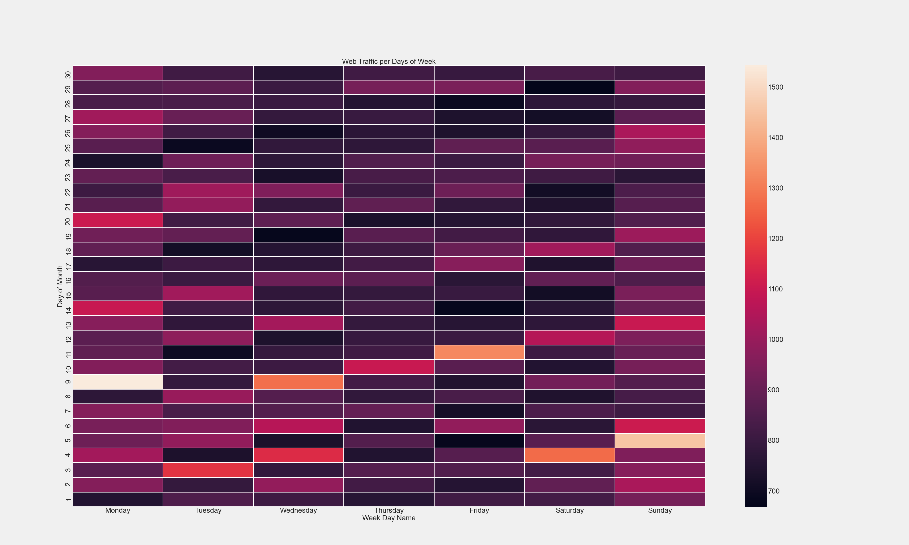
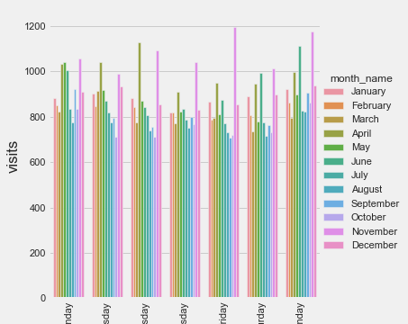

# Project: Time Series Forecasting for Wikipedia daily visits dataset

# Project Structure
- Raw input dataset is taken from [kaggle](https://www.kaggle.com/c/web-traffic-time-series-forecasting/data). The data set is huge I do not have
the raw dataset here in github. (file size=284.6MB)
- `notebooks` directory has all the notebooks for exploratory data analysis,
   visualization, modelling and model interpretation.
- The project is divided into multiple parts:
  + ARIMA (Auto Regressive Integrated Moving Average)
  + VAR (Vector Auto Regression) (for multiple-timesries)
  + Regressors (Linenar, Lasso, Ridge, xgbregressor)
  + fbprophet
  + Deep Learning (LSTM and GRU) (Long Short-term Memory and Gated Recurrent Unit)

# Data Description

Data source: [kaggle](https://www.kaggle.com/c/web-traffic-time-series-forecasting/data)
The first column is the name of the page and rest 550 columns are visited date.

```
Original data: train_1.csv
-----------------------------
rows = 145,063
columns = 551
first column = Page
date columns = 2015-07-01, 2015-07-02, ..., 2016-12-31 (550 columns)
file size: 284.6 MB

Date columns:
------------------
Jul/2015 - 31 days
Aug/2015 - 31 days
Sep/2015 - 30 days
Oct/2015 - 31 days
Nov/2015 - 30 days
Dec/2015 - 31 days

Total     : 184 days
Year 2016 : 366 days (leap year)
Total     : 550 days

NOTE:
For this dataset, missing data is represented by 0.

Time series selected for modelling:
ARIMA: most visited page ==> Special:Search_en.wikipedia.org_desktop_all-agents
                              visited = 675606021

VAR: VAR needs correlated times series like opening and closing of stock.
     But, here I took top page per language to see the workings of VAR models
	 on wikipedia dataset.

Scikit-learn: For usual regressors like linear, lasso, ridge and for also
              ensemble method xgbregressor, I used most visited page.

fbprophet: For facebook prophet time series modelling module, I used a random
           time series. The page is Now You See me in Spanish Language.

deep-learning: For deep learning algorithms like LSTM and GRU, I used the same
               time series as I used in fbprophet.

```

# Part 1: Data Cleaning and Feature Engineering
The data set is super clean, I did not have to do anything. One thing to note
is that the nans are represented by 0. This means if some website has 0 visits,
it may mean either the acutally 0 persons visited the website or simply the data
is not available for that day.
The first column is Page and rest 550 columns are dates.
For the time series we can create date time for visualization and also for the
linear regression modellings.
```python
df['year'] = df['date'].dt.year # yyyy
df['month'] = df['date'].dt.month # 1 to 12
df['day'] = df['date'].dt.day # 1 to 31
df['quarter'] = df['date'].dt.quarter # 1 to 4
df['dayofweek'] = df['date'].dt.dayofweek # 0 to 6
df['dayofyear'] = df['date'].dt.dayofyear # 1 to 366 (leap year)
df['weekend'] = ((df['date'].dt.dayofweek) // 5 == 1)
df['weekday'] = ((df['date'].dt.dayofweek) // 5 != 1)
df['day_name'] = df['date'].dt.day_name() # Monday
df['month_name'] = df['date'].dt.month_name() # January
```

# Part 2: Data visualization and EDA
For time series visualization, plotly is better tool to visualize the data.
For visualization purpose, I looked at only the data of 2016.
```
# of unique pages visited in 2016: 14,506
Top visited page: Special:Search_en.wikipedia.org_desktop_all-agents (675,606,021 visits)
```

# Part 3: Statistics
To fit a linear regression to a given dataset we need the dataset follow
some of the assumptions. They are called assumptions of linear regression.
Since ARIMA tries to fit the linear regression taking account with autocorrelation
with past of itself, still this is a linear regression. We can do some of the
linear regression assumptions.

Test of normality: Using Shapiro-Wilk normality test, I found time series
is NOT normally distributed.

Test of stationarity: I used Augmented Dickey Fuller test to know whether
the given time series is stationary or not. In this particular page, I found
the time series is stationary.

# Part 4: Modelling
For time series, probably ARIMA (or, SARIMAX) is the most popular algorithm to
try on. I used both the usual arima model from `statsmodels` and also a dedicated
library `pdarima` to fit the arima model. The details are explained in the notebook.

After doing arima, modelling I was curious what will VAR model do with the
wikipedia time series. For VAR method to be used the columns of dataset must be
related to each other like opening and closing of the stock. However, just for
the puprpose of the algorithm implentation and fiddling with the model, I looked
at the top 5 pages per language and fitted the model.

Then, I went back in time and wanted to see how will the usual sklean models
like linear regression, lasso and ridge will do with the time series data. I also
did some ensemble learning models like xgbregressor. xgbregressor did pretty good
and gave me the smape value of 6.65 for the training data. For a random page
 (Now You See Me Spanish page), I got the smape of 21.68 on the training data.

For time series forecasting, one of the popular model is prophet open sourced by
facebook. This pretty powerful and useful library for the time series modelling.

Then, I wanted to see the usage of deep learning in time series modelling.
Particularly, I looked at the models like LSTM and GRU which can remember the past
data. I can not use usual CNN since they do not remember the past data points.
LSTM did pretty well and gave me smape of 20.34 for the test dataset.

# Model Evaluation for Time Series
One of the most popular metric to determine the performance of time series
model is SMAPE (Symmetric Mean Absolute Percentage Error).

The formula for SMAPE (Symmetric Mean Absolute Percentage Error) is given below:  

$$
S M A P E=\frac{100 \%}{n} \sum_{t=1}^{n} \frac{\left|F_{t}-A_{t}\right|}{\left(\left|A_{t}\right|+\left|F_{t}\right|\right) / 2}
$$

Where, F is forecast and A is the actual value of time series at given time t.

Python implementation:
```python
def smape(A, F):
    F = A[:len(A)]
    return ( 200.0/len(A) * np.sum(  np.abs(F - A) / 
                                  (np.abs(A) + np.abs(F) + np.finfo(float).eps))
           )
```

Despite the name Symmetric, the smape is not actually symmetric. Take this
example from [wikipedia](https://www.wikiwand.com/en/Symmetric_mean_absolute_percentage_error) for an example:

The SMAPE is not symmetric since over- and under-forecasts are not treated equally. 
This is illustrated by the following example by applying the SMAPE formula:

```
Over-forecasting: At = 100 and Ft = 110 give SMAPE = 4.76%
Under-forecasting: At = 100 and Ft = 90 give SMAPE = 5.26%.
```

 # Some of the EDA results





